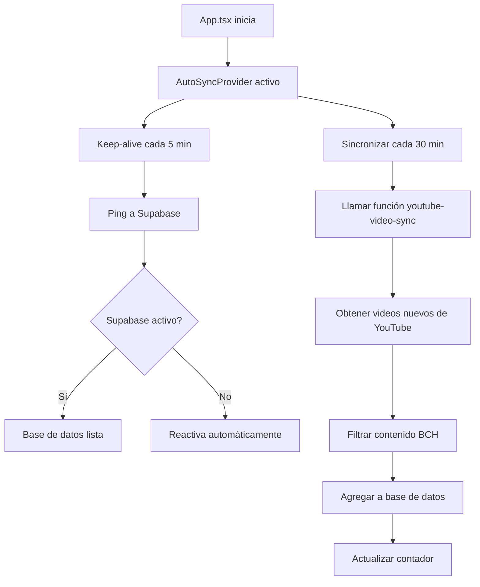

# 🔄 Sistema de Auto-Sincronización BCH Hub

## 📋 Problema Resuelto

Tu sitio BCH Hub tenía estos problemas:
- ❌ Supabase se pausaba por inactividad (plan gratuito)
- ❌ Los videos nuevos no se indexaban automáticamente
- ❌ La sincronización era 100% manual (botón en admin)
- ❌ Cuando Supabase se pausaba, las funciones fallaban

## ✅ Solución Implementada

Hemos implementado un **Sistema de Auto-Sincronización con Keep-Alive** que:

### 1. **Keep-Alive Automático** 🏓
- Hace un "ping" a Supabase cada **5 minutos**
- Evita que el servicio se pause por inactividad
- Mantiene la base de datos siempre activa y lista

### 2. **Sincronización Automática de Videos** 🎥
- Sincroniza videos de YouTube cada **30 minutos** (configurable)
- Busca nuevos videos automáticamente
- Filtra contenido relacionado con Bitcoin Cash (BCH)
- Agrega videos a la base de datos sin intervención manual

### 3. **Indicador Visual de Estado** 📊
- Widget flotante en la esquina inferior derecha
- Muestra el estado de la conexión con Supabase
- Indica cuándo fue la última sincronización
- Permite forzar sincronización manual si es necesario

## 🚀 Archivos Nuevos Agregados

```
src/
├── hooks/
│   └── useAutoSync.ts          # Hook personalizado de auto-sincronización
└── components/
    └── AutoSyncProvider.tsx    # Provider global de sincronización
```

## 🔧 Configuración

### Configuración Predeterminada

```typescript
// Valores por defecto en AutoSyncProvider.tsx
const syncIntervalMinutes = 30;        // Sincronizar cada 30 minutos
const keepAliveIntervalMinutes = 5;    // Keep-alive cada 5 minutos
```

### Cómo Cambiar los Intervalos

Si quieres modificar los tiempos, edita `src/components/AutoSyncProvider.tsx`:

```typescript
// Líneas 34-35
const [syncIntervalMinutes, setSyncIntervalMinutes] = useState(30); // Cambiar aquí
const keepAliveIntervalMinutes = 5; // Cambiar aquí
```

**Recomendaciones:**
- ⏱️ Keep-alive: **NO menor a 5 minutos** (para no sobrecargar)
- 🔄 Sincronización: Entre **15-60 minutos** es óptimo
- 📊 Plan gratuito de Supabase: Limitado a 500MB de transferencia/mes

## 📱 Uso del Widget de Estado

El widget flotante aparece en la esquina inferior derecha y muestra:

```
┌─────────────────────────┐
│ Auto-Sync Status   [ON] │
├─────────────────────────┤
│ 📡 Keep-alive: 2m ago   │
│ ✅ Last sync: 15m ago   │
│ ✓ 12 successful syncs   │
├─────────────────────────┤
│ [Sync Now] [Ping DB]    │
└─────────────────────────┘
```

### Controles del Widget:

1. **Botón ON/OFF**: Activa o desactiva todo el sistema
2. **Sync Now**: Fuerza una sincronización inmediata
3. **Ping DB**: Fuerza un keep-alive manual

## 🔒 Seguridad y Permisos

El sistema funciona con:
- ✅ Credenciales de Supabase (ya configuradas en `src/lib/supabase.ts`)
- ✅ YouTube API Key (ya configurada en las funciones serverless)
- ✅ Solo usuarios admin pueden ver el widget completo

## 🎯 Flujo de Funcionamiento



## 🐛 Solución de Problemas

### Problema: "Supabase está pausado"
**Solución**: El keep-alive debería prevenir esto, pero si ocurre:
1. Haz clic en "Ping DB" en el widget
2. Espera 1 minuto
3. Haz clic en "Sync Now"

### Problema: "Videos no se sincronizan"
**Verificar**:
1. ¿El widget muestra "ON"?
2. ¿Hay errores en la consola del navegador? (F12)
3. ¿Las funciones de Supabase están deployadas?

**Solución**:
```bash
# Verificar funciones en Supabase
supabase functions list

# Re-deployar si es necesario
supabase functions deploy youtube-video-sync
supabase functions deploy youtube-channel-fetch
```

### Problema: "Keep-alive falla constantemente"
**Causa probable**: Credenciales inválidas o proyecto pausado manualmente
**Solución**:
1. Ve a Supabase Dashboard: https://supabase.com/dashboard
2. Verifica que el proyecto esté activo
3. Revisa las credenciales en `src/lib/supabase.ts`

## 📊 Monitoreo

### Logs en Consola del Navegador
El sistema genera logs detallados:

```javascript
🏓 Keep-alive ping to Supabase...
✅ Keep-alive successful
🔄 Starting auto-sync...
✅ Auto-sync completed: { newVideosCount: 3, channelsProcessed: 5 }
```

### Monitoreo en Supabase Dashboard
1. Ve a: https://supabase.com/dashboard/project/[tu-proyecto]/logs
2. Filtra por: "Edge Functions"
3. Busca: `youtube-video-sync` o `keep-alive`

## 🔄 Próximos Pasos (Opcionales)

### Mejoras Recomendadas:

1. **Configuración por interfaz**
   - Agregar un panel en Admin para cambiar intervalos sin código
   
2. **Notificaciones**
   - Email cuando haya errores críticos
   - Notificación cuando se agregan X videos nuevos

3. **Estadísticas**
   - Dashboard con gráficas de sincronizaciones
   - Historial de keep-alive y uptime

4. **Cron Job en Vercel** (para respaldo)
   - Agregar `vercel.json` con cron configuration
   - Ejecutar sincronización desde backend cada hora

## 📞 Soporte

Si encuentras problemas:

1. **Revisa los logs**: Presiona F12 en tu navegador → Console
2. **Revisa el widget**: Busca mensajes de error en rojo
3. **Verifica Supabase**: Dashboard → Logs → Edge Functions

## 🎉 Resultado Final

Con este sistema implementado:

✅ **Supabase nunca se pausará** por inactividad
✅ **Videos nuevos se indexan automáticamente** cada 30 minutos
✅ **No necesitas hacer nada manual** - todo funciona solo
✅ **Tienes control total** con el widget de estado
✅ **Puedes monitorear** el estado en tiempo real

---

**Última actualización**: Enero 2025
**Versión**: 1.0.0
**Autor**: Sistema de Auto-Sincronización BCH Hub
